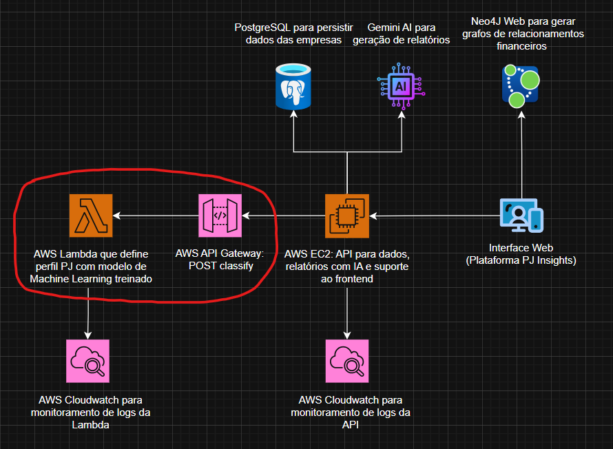

# pjinsights-profileclassifier-lambda

## Descrição
Função AWS Lambda da plataforma PJInsights que classifica empresas em diferentes momentos de vida (início, declínio, expansão e maturidade) através de um modelo de Machine Learning não supervisionado, previamente treinado com o algoritmo K-means.



## Visão geral do funcionamento
- Função: classificar empresas em perfis (`expansao`, `inicio`, `declinio`, `maturidade`).
- Implementação: pré-processamento local + escala (StandardScaler manual) + predição por distância euclidiana a centróides carregados de `app/params/kmeans_params.json`.
- Handler: `app/main.py` -> `lambda_handler(event, context)`

## Entrada esperada
- O handler espera que `event` contenha a chave `body`. `body` pode ser um objeto JSON ou uma string JSON (como enviado pelo API Gateway). O corpo pode ser um objeto único ou uma lista de objetos.
- Cada objeto deve conter as chaves (exatamente como no código):
  - `ID` (identificador da empresa)
  - `VL_FATU` (valor faturamento, número)
  - `VL_SLDO` (valor saldo, número)
  - `DT_ABRT` (data de abertura, string, ex.: "2023-01-19")
  - `DS_CNAE` (descrição do CNAE, string)

## Exemplo completo de evento (igual ao `events/event.json`) — `body` contém uma lista de empresas:
```json
{
  "body": [
    {
      "ID": "CNPJ_00495",
      "VL_FATU": 15000000,
      "VL_SLDO": 5000,
      "DT_ABRT": "2023-01-19",
      "DS_CNAE": "Extração de minério de ferro"
    },
    {
      "ID": "CNPJ_00787",
      "VL_FATU": 300000,
      "VL_SLDO": -20000000,
      "DT_ABRT": "1990-06-15",
      "DS_CNAE": "Telecomunicações sem fio"
    }
  ],
  "resource": "/classify",
  "path": "/classify",
  "httpMethod": "POST",
  "isBase64Encoded": false,
  "headers": { "Content-Type": "application/json" }
}
```

## Fluxo e pré-processamento
1. O código carrega parâmetros de `app/params/scaler_params.json` e `app/params/kmeans_params.json` durante a inicialização.
2. Para cada empresa, `preprocess_empresa` faz:
   - `vl_fatu_log = log1p(VL_FATU)`
   - `vl_sldo_shifted = VL_SLDO - MIN_SALDO_TRAIN + 1` (onde `MIN_SALDO_TRAIN = -85900900.0`)
   - `vl_sldo_log = log(vl_sldo_shifted)`
   - retorna vetor [vl_fatu_log, vl_sldo_log]
3. `scale_features` aplica a transformação do tipo StandardScaler manual:
   - scaled = (features - mean) / scale
   - Os parâmetros carregados são (extraídos de `scaler_params.json`):
     - mean = [15.881886000304164, 18.26364256074996]
     - scale = [2.0720820939319053, 0.19892966368150952]
4. `predict_kmeans` calcula distâncias euclidianas entre cada vetor escalado e os centróides carregados de `kmeans_params.json` e escolhe o índice do centróide mais próximo.

## Parâmetros do modelo (conteúdo de `app/params`)
- `scaler_params.json`:
```json
{"mean": [15.881886000304164, 18.26364256074996], "scale": [2.0720820939319053, 0.19892966368150952]}
```
- `kmeans_params.json`:
```json
{"cluster_centers": [[0.05203342861682275, 0.025663951327768567], [-1.0468972428598908, 0.025448584525791827], [2.3322738925598343, -91.80954827325516], [1.5455672474480782, -0.049629341629874375]], "n_clusters": 4}
```
Observação: os `cluster_centers` devem estar na mesma escala aplicada aos features (ou seja, já no espaço escalado).

## Mapeamento de clusters → perfil
- Definido em `app/main.py`:
  - 0 → `expansao`
  - 1 → `inicio`
  - 2 → `declinio`
  - 3 → `maturidade`

## Saída
- Em caso de sucesso a Lambda retorna `statusCode: 200` e `body` com JSON string contendo uma lista de objetos correspondentes aos inputs, cada um com a chave nova `PERFIL` adicionada (valor em português).

## Exemplo de resposta (body decodificado) — campos auxiliares são preservados:
```json
[
  {
    "ID": "CNPJ_00495",
    "VL_FATU": 15000000,
    "VL_SLDO": 5000,
    "DT_ABRT": "2023-01-19",
    "DS_CNAE": "Extração de minério de ferro",
    "PERFIL": "expansao"
  },
  {
    "ID": "CNPJ_00787",
    "VL_FATU": 300000,
    "VL_SLDO": -20000000,
    "DT_ABRT": "1990-06-15",
    "DS_CNAE": "Telecomunicações sem fio",
    "PERFIL": "declinio"
  }
]
```

## Erros
- Em exceções a função retorna `statusCode: 500` e `body` com `{"error": "mensagem"}`.

## Implantação (SAM / template)
- Template SAM (`template.yaml`) define a função:
  - FunctionName: `ProfileClassifierLambda`
  - Handler: `main.lambda_handler` (no diretório `app/`)
  - Runtime: `python3.12`
  - Evento HTTP: POST `/classify` (API Gateway)

- Para desenvolvimento local: `sam local invoke -e events/event.json` (ajuste o evento conforme o formato esperado).

